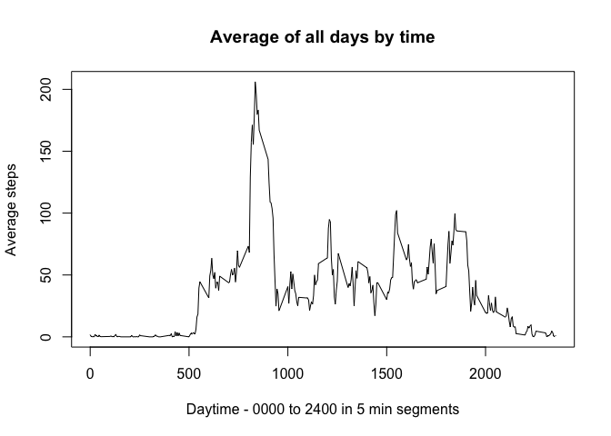

# Reproducible Research: Peer Assessment 1


## Loading and preprocessing the data


```r
library(lattice)
```

```
## Warning: package 'lattice' was built under R version 3.1.3
```

```r
# fetch the data
activity = read.csv("activity.csv")
```

## What is mean total number of steps taken per day?


```r
# split up the step counts by day
stepsByDay = split(activity$steps, activity$date, drop = FALSE)

# stepsByDay now has all step values from each day
# we can calculate the total for each using sapply to loop the sum function
totalEachDay = sapply(stepsByDay, sum)

# and create a histogram of the results
hist(totalEachDay, main = "Histogram of total steps / day",
     xlab = "Total steps", ylab = "Count of days")
```

 

```r
# since we have the data all compact, let's just run a quick summary of the data
# and capture mean & median
sumStats = summary(totalEachDay)
stepsMean = sumStats[["Mean"]]
stepsMedian = sumStats[["Median"]]

# and show the results to our readers
sprintf("Average steps per day = %d", stepsMean)
```

```
## [1] "Average steps per day = 10770"
```

```r
sprintf("Median of steps per day = %d", stepsMedian)
```

```
## [1] "Median of steps per day = 10760"
```

## What is the average daily activity pattern?


```r
# break up the data by 5 minute chunks and calculate a 5 min avg for all days
timeSplit = split(activity$steps, activity$interval)
splitAverages = sapply(timeSplit, mean, na.rm = TRUE)

# and plot the timeseries showing the activity distribution throughout the average day
plot(splitAverages ~ names(timeSplit), type = "l", main = "Average of all days by time",
     xlab = "Daytime - 0000 to 2400 in 5 min segments", ylab = "Average steps")
```

 

```r
# find the max average on a daily basis, and the time associated with this max
avgMaxTime = activity$interval[which.max(splitAverages)[[1]]]
avgMaxValue = max(splitAverages)

sprintf("On average the most active time appears to be %04d with an average of %3.2f steps!", avgMaxTime, avgMaxValue)
```

```
## [1] "On average the most active time appears to be 0835 with an average of 206.17 steps!"
```

## Imputing missing values


```r
# however, there are a lot of NA values in the data and these might be messing with
# the overall statistics
sprintf("There are %d NA values in the %d measurements!", sum(is.na(activity$steps)), length(activity$steps))
```

```
## [1] "There are 2304 NA values in the 17568 measurements!"
```

```r
# let's try to replace those NA values with something more meaningful and see if the
# usage profile changes.  Let's give the user the benefit of the doubt and replace all
# NA values with the average value from all non-NA events relative to that same time
# slot
activityNew = activity
activityNew = transform(activityNew, steps = ifelse(is.na(steps),splitAverages,steps))

# new we can re-compute some of those earlier stats and create some comparison data
# and charts to see if imputing those missing values changes the story

# split up the step counts by day
stepsByDayNew = split(activityNew$steps, activityNew$date, drop = FALSE)

# stepsByDay now has all step values from each day
# we can calculate the total for each using sapply to loop the sum function
totalEachDayNew = sapply(stepsByDayNew, sum)

# Let's show the histograms from the old and new data
hist(totalEachDay, main = "Prior histogram of total steps / day",
     xlab = "Total steps", ylab = "Count of days")
```

 

```r
hist(totalEachDayNew, main = "New histogram of total steps / day",
     xlab = "Total steps", ylab = "Count of days")
```

 

```r
# since we have the data all compact, let's just run a quick summary of the data
# and capture mean & median
sumStatsNew = summary(totalEachDayNew)
stepsMeanNew = sumStatsNew[["Mean"]]
stepsMedianNew = sumStatsNew[["Median"]]

# and show the results to our readers
sprintf("Old average of steps per day was %d, new average is %d", 
        stepsMean, stepsMeanNew)
```

```
## [1] "Old average of steps per day was 10770, new average is 10770"
```

```r
sprintf("Old median of steps per day was %d, new median is %d", stepsMedian, stepsMedianNew)
```

```
## [1] "Old median of steps per day was 10760, new median is 10770"
```

```r
# break up the data by 5 minute chunks and calculate a 5 min avg for all days
timeSplitNew = split(activityNew$steps, activityNew$interval)
splitAveragesNew = sapply(timeSplitNew, mean, na.rm = TRUE)

# and plot the timeseries for the older data and newer data
# showing the activity distribution throughout the average day
plot(splitAverages ~ names(timeSplit), type = "l",
     main = "Average by time before & after replacing NAs",
     xlab = "Daytime - 0000 to 2400 in 5 min segments", ylab = "Average steps")
lines(splitAveragesNew ~ names(timeSplitNew), type = "l", col = "red")
legend("topright", c("Old Averages", "New Averages"), col = c("black", "red"), lty = 1)
```

 

```r
# find the max average on a daily basis, and the time associated with this max
avgMaxTimeNew = activityNew$interval[which.max(splitAveragesNew)[[1]]]
avgMaxValueNew = max(splitAveragesNew)

sprintf("On average the most active time appears to be %04d with an average of %3.2f steps!",
        avgMaxTimeNew, avgMaxValueNew)
```

```
## [1] "On average the most active time appears to be 0835 with an average of 206.17 steps!"
```

The most active time and average steps in that time are exactly the same with and without replacement of the NA values.  There is a slight shift in the median.  Overall there was minimal change to the summary stats after replacing the NA values

## Are there differences in activity patterns between weekdays and weekends?


```r
# add a new column that holds a T/F for weekend or not
activityNew = transform(activityNew, 
    weekend = ifelse(weekdays(as.Date(date)) == c("Saturday", "Sunday"), "Weekend", "Weekday"))

# timeSplitNew = split(activityNew$steps, activityNew$interval)
# splitAveragesWeekend = sapply(timeSplitWeekend, mean, na.rm = TRUE)

activityNewDaily = aggregate(activityNew$steps, by=list(activityNew$interval,
    activityNew$weekend), FUN=mean)

colnames(activityNewDaily) = c("interval", "weekend", "steps")

# use lattice to create plots of the average steps / 5 min segment of weekdays vs weekends
xyplot(steps ~ interval | weekend, data = activityNewDaily, 
        xlab = "Daytime - 0000 to 2400 in 5 min segments", ylab = "Average steps", 
        layout = c(1, 2), type = "l")
```

 

```r
# finally, let's break the data up and figure out the true mean & median
weekVWeekend = split(activityNew$steps, activityNew$weekend)
weekdaySummary = summary(weekVWeekend$Weekday)
weekendSummary = summary(weekVWeekend$Weekend)
```

Based on the average data through weekdays vs weekend days, it appears the user is generally less active in the early parts of the day, then considerably more active starting around 10:00 am.

Mean steps for the weekend activity are 42.26 and for weekdays 36.65 showing the user to be slightly more active overall during the weekends.
